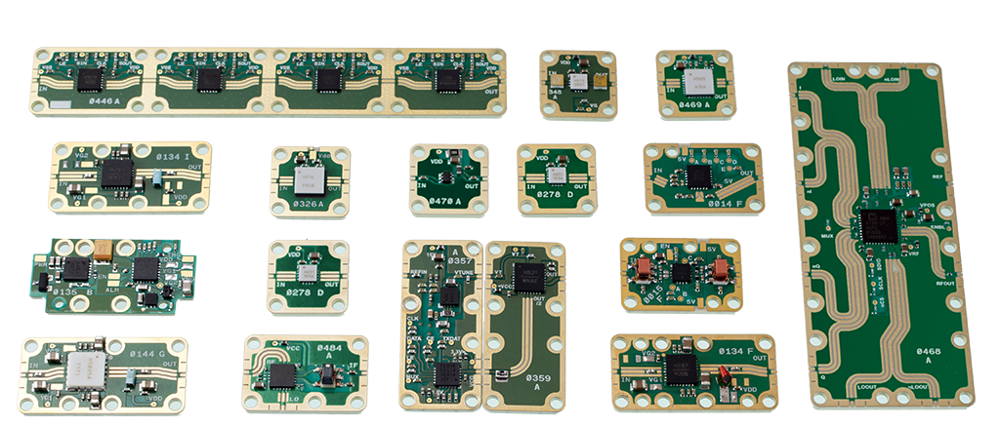
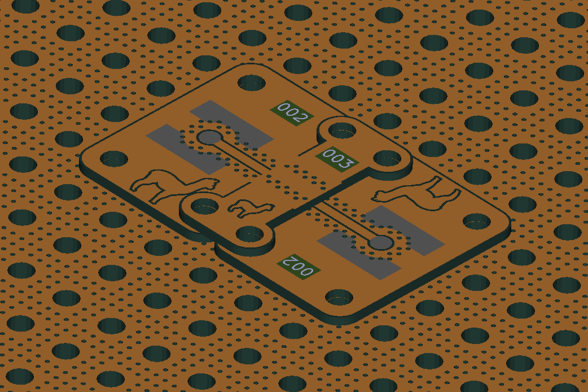
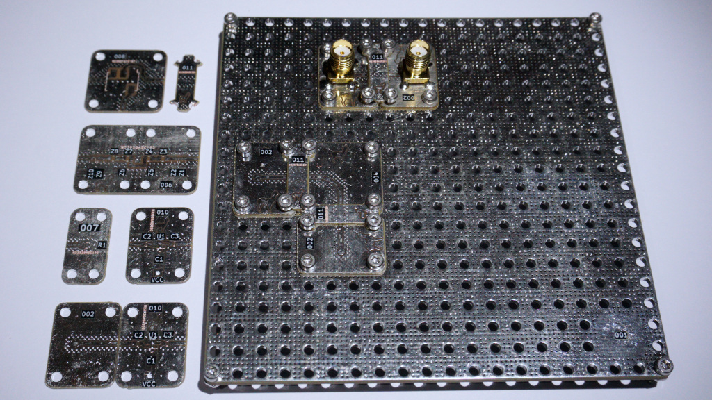
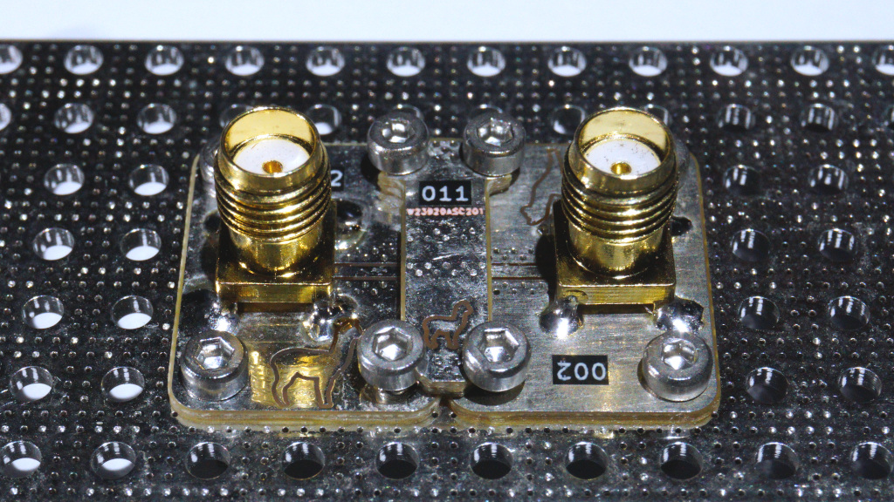
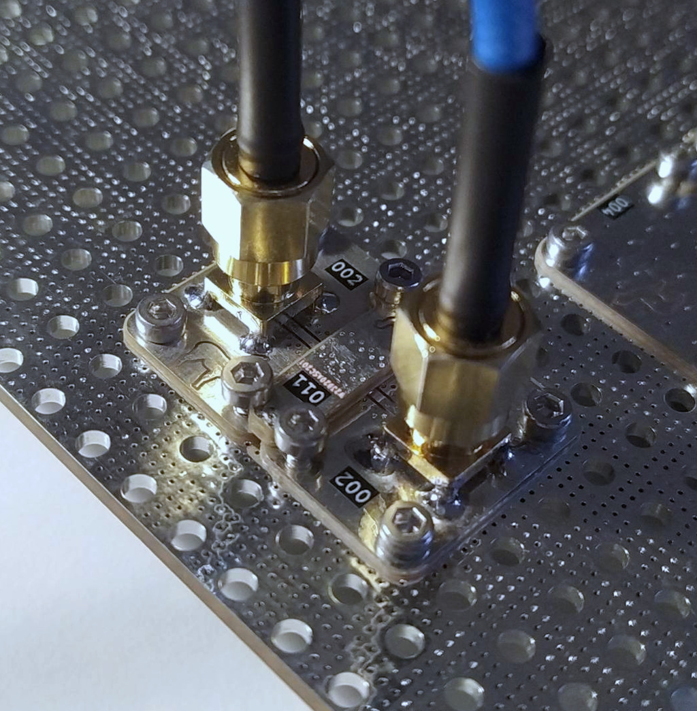
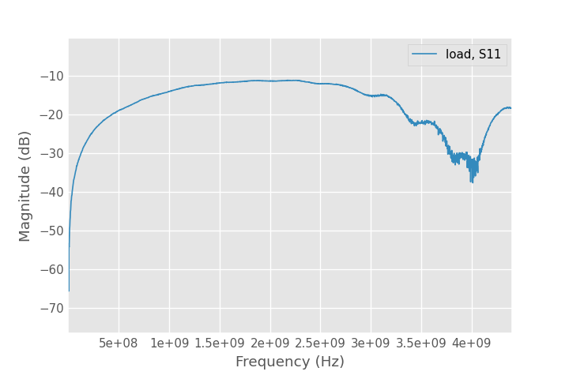

# Modular RF Bench

I came across an awesome system for rapid prototyping RF and Microwave solutions
by connecting individual components on small PCBs, just like LEGO.
This [Modular building block system for RF and microwave design of prototypes](https://patents.google.com/patent/US10784633B2/en?assignee=X-Microwave&oq=X-Microwave) is in my opinion a very clever way of building RF
circuits. On their [website](https://www.xmicrowave.com/) the sell almost every
available modern RF IC or passive network in a form of a rectangle PCBs.

The whole system is well polished and every part has some sort of improvement.
For example the boards interconnection has a ground cutout, probably for better
impedance matching. The connection is done (according to their patent) with a
small piece with diamond particles that improve contact. That's why they claim
that this system can be used up to ~67 GHz.

Of course this performance comes at a price.

# My own design
I liked this idea so much that I wanted to check how *bad* will standard FR4
boards perform if someone would make a system like this one. But without all
those whistles.

So I made ten different designs inspired by that system. Ordered it on PcbWay.
And when will it arrive I will test it with my VNA.

---
After some time the boards arrived in decent quality. I soldered SMA connectors
to two boards designed for them and screwed them to the PCB base, together with
a small interconnecting PCB.

I tried to follow X Microwave design but my idea had some problems. The small
board with the number 011 that was designed to connect other boards didn't make
good contact after mounted with screws. It just bulged up and the center signal
trace didn't touched the traces on the other PCBs. But after adding a small
amount of solder to the trace it started to work.

## Measurements
I'm posting only the S11 measurements with a 50 Ohm termination on the second
port of the setup because I'm measuring with a nanoVNA and I'm getting strange
results for other S parameters. After I  get my hand on a better VNA in a week
or so I will redo the measurements.

I wasn't excepting much after 0,8 mm FR4 PCB but it is usable up to 1,5 GHz.
The board to board connection is working and everything is pretty durable.
